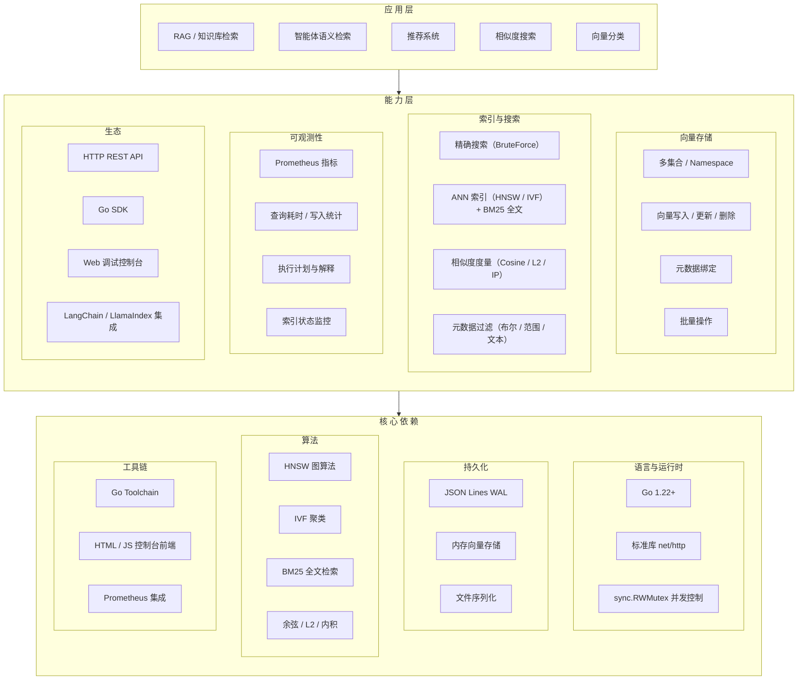
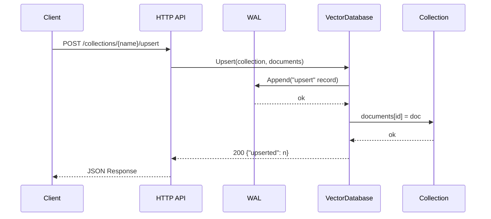
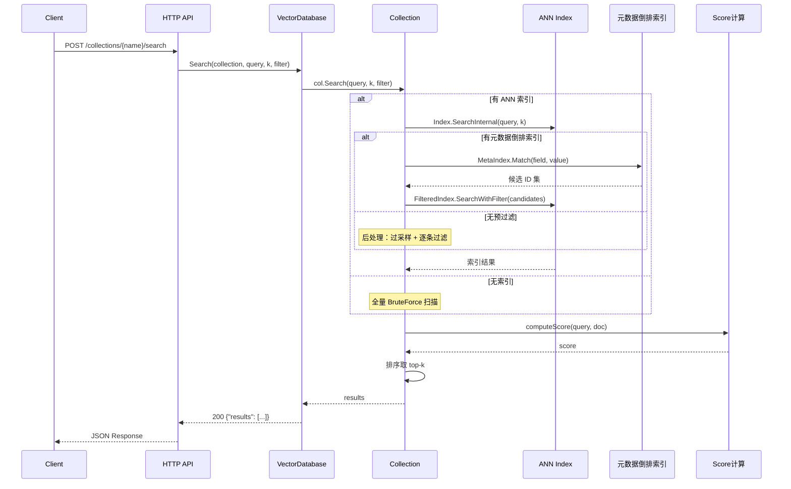
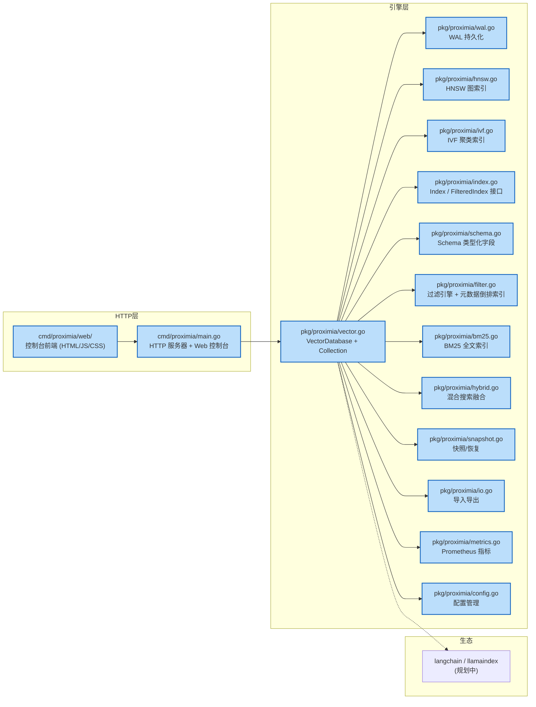
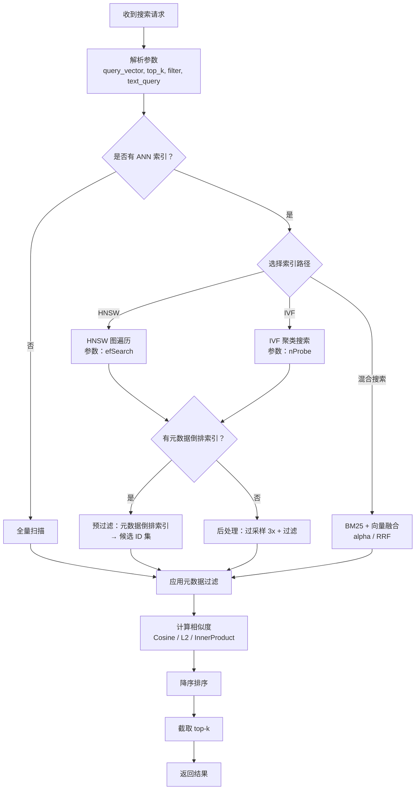
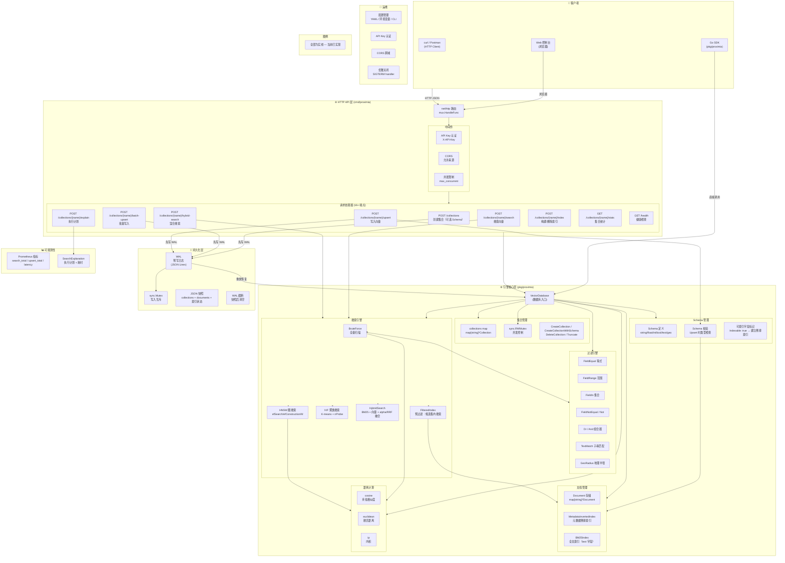

# Proximia 技术设计与项目定位

> 版本: 1.1 | 最后更新: 2026-05-31

## 修订历史

| 版本 | 日期 | 变更 |
|------|------|------|
| 1.1 | 2026-05-31 | 补充 Schema、BM25、混合搜索、控制台设计；更新架构图对齐实装；补充运算符语义说明 |
| 1.0 | 2026-05-30 | 初始版本，完成 HNSW/IVF 索引、WAL、HTTP API、控制台、快照、指标、导入导出 |

## 1. 项目定位

Proximia 目标是构建一个面向智能体/搜索引擎场景的向量数据库。

核心目标：
- 支持智能体语义检索、检索增强生成（RAG）、知识库搜索、推荐、相似度匹配等场景
- 提供向量数据库关键能力，对齐主流同类产品的核心能力集
- 提供可调试、可观察的 Web 控制台，帮助理解向量数据库的使用方法与内部原理

## 2. 架构

### 2.1 三层架构总览

Proximia 整体架构分为三层：**应用层 → 能力层 → 核心依赖层**，上层对下层进行能力调用与组合。

### 2.2 数据流设计

#### 写入路径

所有写入操作先记录预写日志（WAL）确保持久性，再更新内存索引结构。

#### 查询路径

搜索请求经过索引选择（HNSW/IVF/BF）→ 元数据过滤（预过滤或后处理）→ 相似度计算 → 排序 → top-k 截断的完整链路。

### 2.3 当前实现状态

| 模块 | 状态 | 说明 |
|------|------|------|
| HTTP REST API（15+ 个端点） | ✅ 已实现 | collections CRUD、upsert、batch-upsert、batch-delete、search、hybrid-search、recall、explain、index、stats、health、ready、snapshot、restore、metrics、export、import、console |
| 内存向量存储 | ✅ 已实现 | Collection 管理，map 存储，RWMutex 并发控制 |
| WAL 持久化 | ✅ 已实现 | JSON Lines 格式，启动时重放恢复 |
| 精确搜索（BruteForce） | ✅ 已实现 | 全量扫描 + 排序取 top-k |
| 三种距离度量 | ✅ 已实现 | Cosine、Euclidean (L2)、InnerProduct |
| 元数据过滤 | ✅ 已实现 | 等式过滤、范围过滤、组合器 |
| HNSW 索引 | ✅ 已实现 | 图索引结构，支持 efSearch/efConstruction/M 参数 |
| IVF 索引 | ✅ 已实现 | K-means 聚类 + 倒排，支持 nProbe 参数 |
| Web 控制台 | ✅ 已实现 | Go embed + HTML/JS SPA，Dashboard/Collections/Search/Index/Explainer |
| Prometheus 指标 | ✅ 已实现 | 查询耗时、写入统计、向量计数、自建轻量指标 |
| 查询解释器 | ✅ 已实现 | 搜索路径、候选数、耗时、过滤条件展示 |
| 导入 / 导出 | ✅ 已实现 | JSON Lines 格式、NDJSON 流式导入导出 |
| 快照 / 恢复 | ✅ 已实现 | JSON 全量保存 + WAL 截断 |
| LangChain / LlamaIndex | ⏳ 规划中 | 生态集成适配器 |

### 2.4 模块依赖关系

### 2.5 搜索执行流程

### 2.6 系统架构全景图

图中清晰展示了当前完整架构：
- **三层架构**：HTTP API 层（16+ 端点 + 中间件）→ 引擎核心层 → 持久化层
- **Schema 管理**：类型化字段定义、写入时校验、自动建立倒排索引
- **过滤引擎**：7 种过滤原语，支持复合组合
- **搜索引擎**：4 条搜索路径（BF/HNSW/IVF/Hybrid）+ 预过滤
- **全文检索**：BM25 索引（text 类型字段）
- **运维能力**：配置、认证、CORS、优雅关闭
- **全部已实现**（无虚线/规划中标记）

## 3. 核心能力定义

向量数据库必须具备的能力：

### 3.1 向量存储与索引
- 向量数据的高效写入与持久化
- 支持多种索引结构：HNSW、IVF、倒排索引（元数据 + BM25）
- 支持向量替换、删除、批量写入与批量更新
- 支持 PQ 向量量化（⏳ 规划中）
- 自动分片与数据分区设计（⏳ 规划中）

### 3.2 相似度搜索
- 支持欧氏距离、余弦相似度、内积等多种相似度度量
- 支持近似最近邻（ANN）和精确搜索
- 支持 top-k 搜索（半径搜索 ⏳ 规划中）
- 支持动态搜索参数调优，如 efSearch、nProbe

### 3.3 元数据与过滤
- 向量条目关联结构化元数据字段
- 支持基于元数据字段的布尔过滤、范围过滤、文本过滤
- 支持混合查询：向量相似度 + 结构化过滤的组合查询

### 3.4 数据模型与API
- 支持多集合/空间（namespace）管理
- 支持 schema 约束、字段定义、索引配置
- 提供 HTTP/REST API，兼容常见向量数据库调用模式
- 提供本地 SDK（Go）用于集成与开发

### 3.5 可观测性与调试
- API 日志、查询耗时、写入耗时统计
- 向量索引状态、节点/分片状态、搜索命中率指标
- 支持导出指标给 Prometheus 或自定义监控
- 支持执行计划与查询解释功能

### 3.6 数据管理与运维能力
- 支持索引构建/重建
- 支持数据导入/导出、备份与恢复
- 支持版本管理、迁移流程
- 支持配置管理与运行时参数调优

### 3.7 生态与扩展
- 支持插件式距离度量、索引算法扩展
- 支持与主流 LLM/检索框架集成（如 LangChain、LlamaIndex）
- 支持向量数据与文本数据联合处理

## 4. 主流同类产品对标

Proximia 的能力应覆盖或对标以下主流产品的核心维度：

- Pinecone：高性能索引、向量 + 元数据过滤、REST API
- Milvus：多种索引、分布式扩展、数据管理能力
- Weaviate：知识图谱、混合查询、元数据过滤
- Qdrant：高性能查询、向量 + 结构化过滤、Go/REST SDK
- Elasticsearch 向量功能：混合搜索、文本与向量联合查询

## 5. 控制台设计

### 5.1 目标
- 提供可交互的调试平台，**验证向量数据库所有核心能力**
- 支持向量写入、搜索、过滤、索引构建、混合搜索、召回分析
- **召回效果验证**：支持 ANN vs BruteForce 对比，展示 recall@k、精度、延迟
- 可视化展示向量查询结果、距离分布、索引状态、搜索耗时、执行计划
- 理解向量数据库内部原理

### 5.2 控制台功能模块

| 模块 | 功能 | 验证的能力 |
|------|------|-----------|
| **Dashboard** | 概览：集合数、向量总数、索引数、服务状态 | 系统健康度 |
| **Schema Designer** | 可视化创建集合 + 类型化字段 + 标记 Indexable | Schema 管理、元数据倒排索引 |
| **Data Manager** | 文档浏览/新增/编辑/删除、批量 Upsert、导入导出 | CRUD、Batch 操作、Import/Export |
| **Search Lab** | 向量搜索、混合搜索（BM25+向量）、丰富过滤条件 | HNSW/IVF/BF/HybridSearch、7 种 Filter |
| **Recall Analyzer** | ANN vs BruteForce 对比：recall@k、延迟、候选数 | 索引质量评估、参数调优 |
| **Index Manager** | 构建/删除索引、查看状态、调整 HNSW/IVF 参数 | 索引生命周期管理 |
| **Query Explainer** | 执行计划：搜索路径、耗时、过滤条件、候选数 | 搜索过程可视化 |
| **API Playground** | 交互式 API 调用、curl 命令生成 | HTTP API |

### 5.3 Recall Analyzer 设计

召回分析是控制台的核心调试功能，帮助开发者理解 ANN 索引的精度：

1. **模式**：对同一查询同时执行 ANN 搜索（HNSW/IVF）和 BruteForce 精确搜索
2. **对比指标**：
   - `recall@k` = ANN 结果中命中的 BF top-k 文档数 / k
   - `precision@k` = ANN 结果中相关文档的比例
   - `延迟对比` = ANN 耗时 vs BF 耗时
   - `候选数对比` = ANN 扫描的文档数 vs BF 扫描数
3. **可视化**：双列表并排展示 ANN 和 BF 结果，命中项高亮标记
4. **参数调优**：实时调整 efSearch（HNSW）、nProbe（IVF），观察 recall 变化

### 5.4 技术实现
- 前端：纯 HTML + CSS + JavaScript（Go embed 嵌入）
- 后端：调用现有 REST API + 新增 `/collections/{name}/recall` 端点
- 新增端点 `POST /collections/{name}/recall` 在一次请求中同时执行
  ANN 搜索和 BruteForce 搜索，返回对比数据

## 6. 技术栈建议

- 核心引擎：Go（零外部依赖，仅标准库）
- 控制台：Go embed + HTML/CSS/JS SPA
- 数据持久化：JSON Lines WAL + JSON 快照
- 索引算法：Go 手写实现 HNSW、IVF、BM25，无第三方 ANN 库
- API：Go HTTP/REST（net/http 标准库）
- 可视化与调试：8 页面 SPA 控制台（Dashboard/Schema/Data/Search/Recall/Index/Explain/API Playground）

## 7. 学习目标与价值

该项目的价值不仅是做出一个向量数据库产品原型，
更在于通过“构建一个可调试的向量数据库控制台”，让开发者真正理解：
- 向量数据如何存储与索引
- 相似度搜索的本质与调优空间
- 向量数据库与结构化数据混合查询的设计
- 为什么向量数据库需要特定的索引与调度能力

## 8. 未来扩展方向

- 多节点分布式部署
- 语义搜索与向量搜索融合
- 自定义距离度量与向量运算插件
- 向量聚类、近邻可解释性分析
- 主流检索框架集成和生态适配
